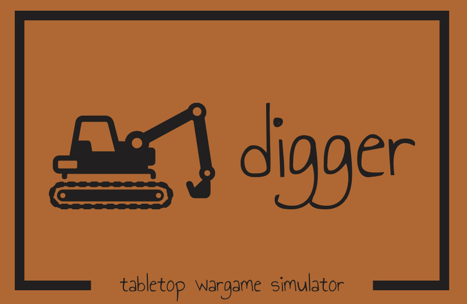
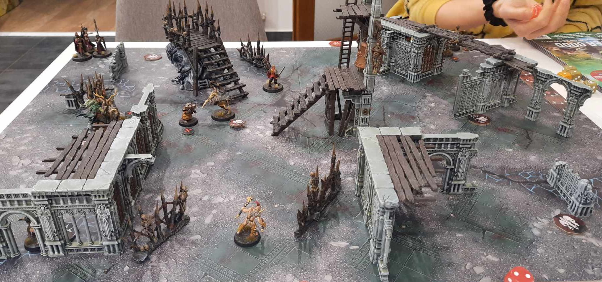
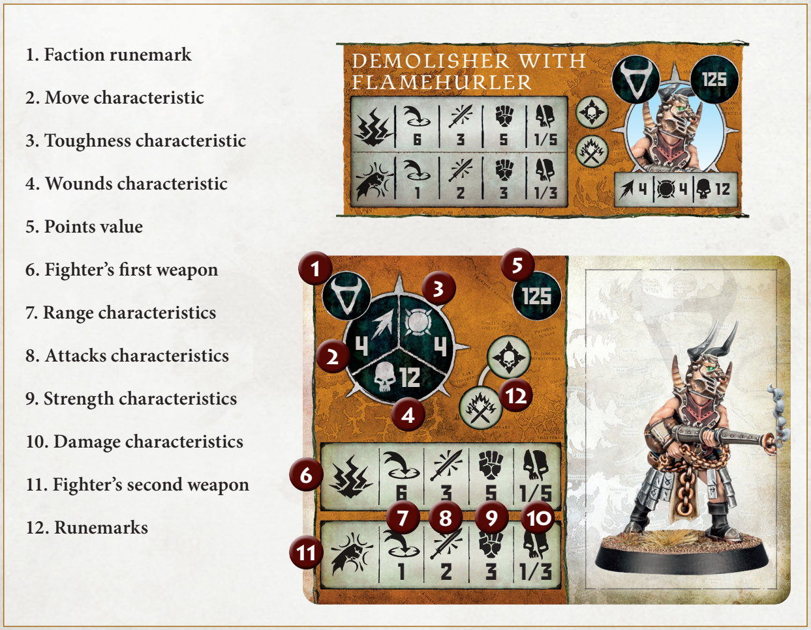

### Project Digger is an environment for training and evaluating reinforcement learning agents in the context of tabletop wargame Warcry.

*A Warcry battle:*

## Warcry game overview

In Warcry game by Games Workshop company, players assemble warbands using models from various factions. Each model has specific characteristics including movement, attacks, and abilities. Players take turns activating their models to move, attack, or perform special actions. Combat is resolved through dice rolls, with factors like weapon strength and toughness influencing the outcome. Victory is achieved by completing objectives, such as eliminating enemy models or controlling key points on the battlefield.

See https://www.warhammer-community.com/warcry-downloads/ for the official Warcry rules.

## Warcry rules in brief:

1. Two players choose their "races" and build their armies to meet 1000 pts. point limit using point values of differe fighter types.

2. Terrain setup, victory condition, deployment map are chosen randomly drawing a card.
   - Terrain setup tells exactly how terrain elements are positioned on a battlefield
   - Victory condition specifies exactly what each of the players needs to do to win the battle. 
     - E.g. army's general needs to be in proximity of some point in the battlefield
   - Deplyment map specifies exactly the areas where each player can deploy his fighters
     - In most deployment maps the fighters come to battlefield gradually in different rounds.
	
3. Battle is fought, in most cases it takes four rounds.In each round:

   - Initiative phase
     - Each player rolls 6 dices. If multiple dices have same score (e.g. two dices with value of 6), then these dices can be considered as doubles / triples / quads and can be used to cast models' special abilities. The rest of the dices is used to determine starting player in the round.
   - Reserve phase
     - Models which are deployed on the battlefield according to the deployment map
   - Combat phase
     - In this phase players do actions with their fighters. They take turns in which the player activates one of his fighters and performs an action he or she chooses.
     - Action can be either of following: move, attack, disengage, wait. Moreover, the fighters can use their special abilities along performing the actions. Examples of special abilities are making some extra movement, boost fighter's strength or inflict damage to an enemy fighter.

4. Battle is evaluated

*Example of stats of a fighter:*

## Digger project progress

What is implemented:
  - Battle structure - rounds, players taking turns within rounds
  - Fighters and loading their stats
  - Fighters' movement, including movement around obstacles
  - Training of DQN agent (each fighter is an agent)
  - Discrete action space for moving
  
  
What is not implemented:
  - Initiative roll
  - Combat
  - Special abilities
  - Effective order of fighters' activation (e.g. doing some action and ability with A and then with B might be preferable to activating fighters in reverse order)
	- Can we e.g. compare Q values between fighters?
  - Other DQN than basic deep ANN (e.g. CNN evaluating other fighters' and terrain position)
  - Knowledge sharing among fighters
  - Other objective than basic move-to-target
  - Deplyment map

