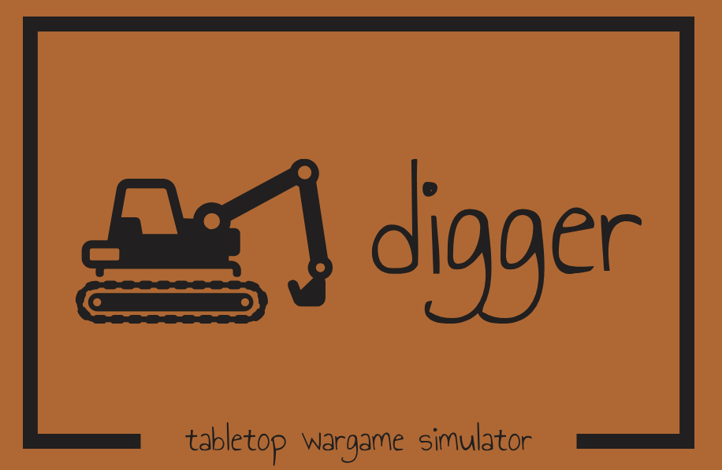
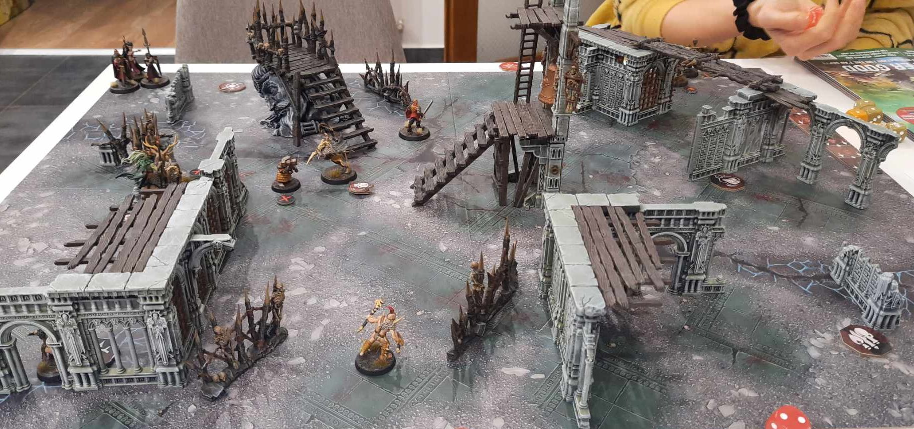
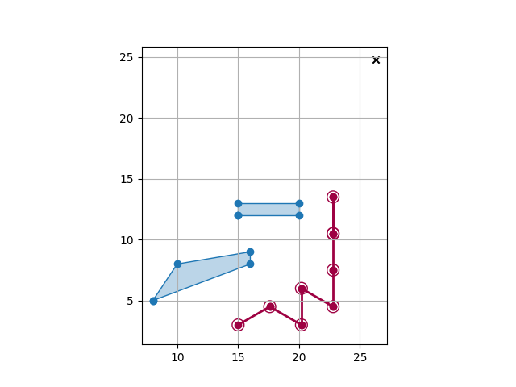
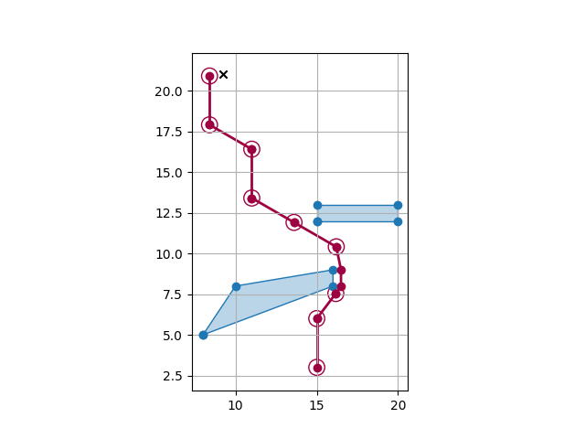
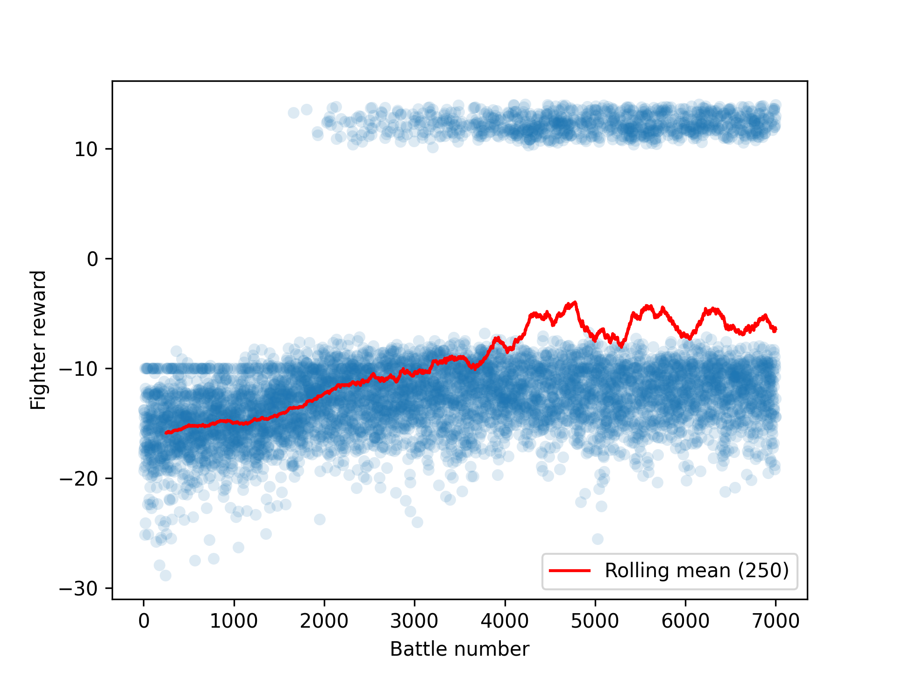
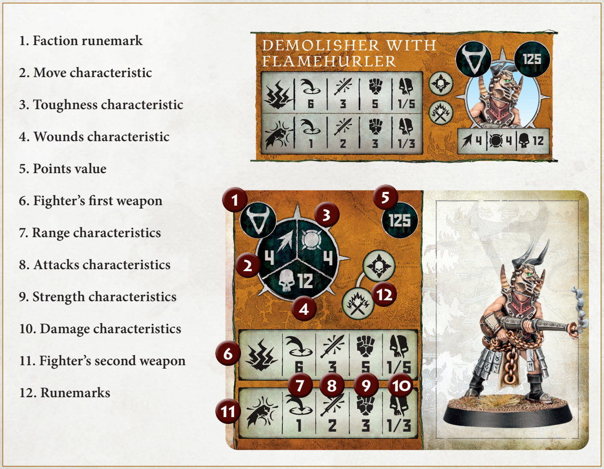

### Project Digger is an environment for training and evaluating reinforcement learning agents in the context of tabletop wargame Warcry.

*A Warcry battle:*

## Warcry game overview

In Warcry game (by Games Workshop Ltd.), players assemble warbands using models from various factions. Each model 
has specific characteristics including movement, attacks, and abilities. Players take turns activating their models 
to move, attack, or perform special actions. Combat is resolved through dice rolls, with factors like weapon 
strength and toughness influencing the outcome. Victory is achieved by completing objectives, such as eliminating 
enemy models or controlling key points on the battlefield. See part "Warcry rules in brief" for more details.

## Project summary

It is nice to meet friends to play some tabletop games. It is also nice to win the match, at least sometimes. To win, one needs to have a sound strategy that has been thought through and tested, ideally. This is where Digger will take place. Purpose of this project is to create a digital replica of Warcry environment with its rules. This environment allows reinforcement learning agents to train themselves and substitute human oponents when nobody is around to play or to help to test a strategy. 

This project is under development. So far I have created the structure of the environment and I made an agent to 
learn how to reach a target point on the battlefield with obstacles using deep Q-learning. Although these tasks are 
quite simplistic in comparison to complex warcry rules, it was necessary to build quite extensive foundations allowing 
for these tasks. See part "Project development progress" for detailed description of what has been done and what are the next steps.

## Project development progress

### What is implemented

  - Battle structure - rounds, players taking turns within rounds
  - Fighters and loading their stats
  - Fighters' movement, including movement around obstacles
  - Training of DQN agent (each fighter is an agent)
  - Discrete action space for moving
  
  
### What is not implemented:

  - Initiative roll
    - Each player rolls several dices and adds extra "wild dices".
      - He then decides how he constructs his doubles/triples/quads for abilities (see above)
      - The rest of the dices is used to determine the starting player in the round.
    - This is another moment where quite complex decision-making is needed. 
    - Should there be another agent on the player level, which decides which fighter to activate?
    - He would need to take into account the fighters' stats and the current situation on the battlefield.
  - Combat
    - Involves quite a lot of stochastic outcomes (dice rolls).
    - Quite complex decision-making, as the fighters have different abilities and weapons.
    - Programming of the combat system itself is probably not that challenging, but the decision-making part is.
  - Special abilities
    - Increases the complexity of the decision-making.
    - Some special abilities can e.g. target different fighters or different points in the battlefield space.
  - Effective order of fighters' activation 
    - doing some action and/or ability with fighter A and then with fighter B might be preferable to activating fighters in reverse order.
	- Should this be included also in some player-level agent?
    - Can we compare Q values between fighters to assess the order of activation?
  - Other DQN than basic deep ANN (e.g. CNN evaluating other fighters' and terrain position)
    - Different graphical layers for different information (e.g. terrain, fighters, objectives) 
  - Knowledge sharing among fighters
    - E.g. one fighter should know other fighter's Q values.
    - Between friendly fighters and possibly also between enemy fighters.
  - Other objective than basic move-to-target
    - E.g. killing most enemy fighters, controlling most objective points, etc. 
  - Deployment map
    - Again involves some decision-making, as the fighters' deployment can influence the battle outcome. 
  - Continuous action space for moving
    - This would be more realistic, but also more complex.
    - The action space for movement is now discretized.

## Results showcase

The following two images show the results of the DQN agent training to reach a target point on the battlefield. The 
agent was trained for 7000 episodes. The agent's path is shown in red, the obstacles are shown in blue, and the 
target is cross mark. Starting position is fixed in the bottom part. Target position is chosen randomly in the top part.

The first image shows the agent's path to the target point during one of the 
episodes when the target was not reached.  The second image shows the agent's path to the target point during one of the episodes when the target was reached.

Finally, the following image shows the rewards the agent received during the training. Agent is rewarded when reaches 
the target and penalized for leaving the battlefield as well as being distant from the target each round.

Although the agent was able to reach the target in many episodes, we can see the learning process as the share of positive rewards increases over time.

## Warcry rules in brief:

1. Two players choose their factions (races) and build their armies to meet 1000 pts. point limit using point values of different fighter types.

2. Terrain setup, victory condition, deployment map are chosen randomly drawing a card.
   - Terrain setup tells exactly how terrain elements are positioned on a battlefield
   - Victory condition specifies exactly what each of the players needs to do to win the battle. 
     - E.g. army's general needs to be in proximity of some point in the battlefield
   - Deplyment map specifies exactly the areas where each player can deploy his fighters
     - In most deployment maps the fighters come to battlefield gradually in different rounds.
	
3. Battle is fought, in most cases it takes four rounds. In each round:

   - Initiative phase
     - Each player rolls 6 dices. If multiple dices have same score (e.g. two dices with value of 6), then these dices can be considered as doubles / triples / quads and can be later used to cast models' special abilities. The rest of the dices is used to determine starting player in the round.
   - Reserve phase
     - Models are deployed on the battlefield according to the deployment map
   - Combat phase
     - In this phase players do actions with their fighters. They take turns in which the player activates one of his fighters and performs an action he or she chooses.
     - Action can be either of following: move, attack, disengage, wait. 
     - Moreover, the fighters can use their special abilities along performing the actions. 
       - Examples of special abilities are making some extra movement, boost fighter's strength or inflict damage to an enemy fighter.

4. Battle is evaluated

See https://www.warhammer-community.com/warcry-downloads/ for the official Warcry rules download

*Example of stats of a fighter:*

